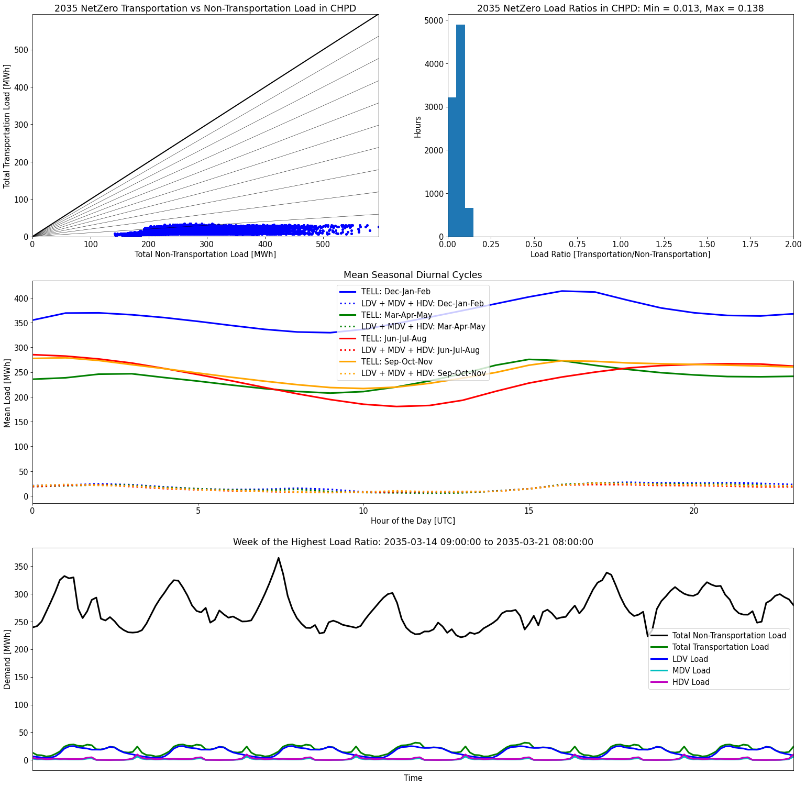

# Balancing Authority Level Analyses
>
| Name | Time Series | Transportation BAU 2035 | Transportation NetZero 2035 |
| :-: | :-: | :-: | :-: |
| AVA |  |  |  |
| AZPS |  |  |  |
| BANC |  |  |  |
| BPAT |  |  |  |
| CHPD |  |  |  |
| CISO |  |  |  |
| DOPD |  |  |  |
| EPE |  |  |  |
| GCPD |  |  |  |
| IID |  |  |  |
| IPCO |  |  |  |
| LDWP |  |  |  |
| NEVP |  |  |  |
| NWMT |  |  |  |
| PACE |  |  |  |
| PACW |  |  |  |
| PGE |  |  |  |
| PNM |  |  |  |
| PSCO |  |  |  |
| PSEI |  |  |  |
| SCL |  |  |  |
| SRP |  |  |  |
| TEPC |  |  |  |
| TIDC |  |  |  |
| TPWR |  |  |  |
| WACM |  |  |  |
| WALC |  |  |  |
| WAUW |  |  |  |
